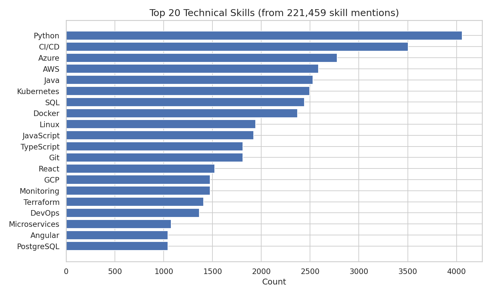
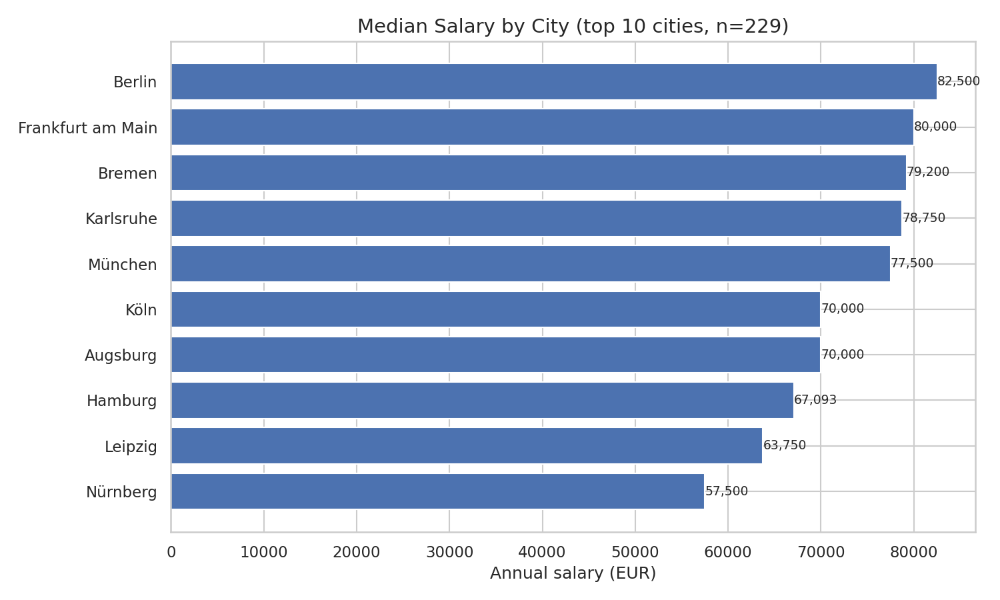
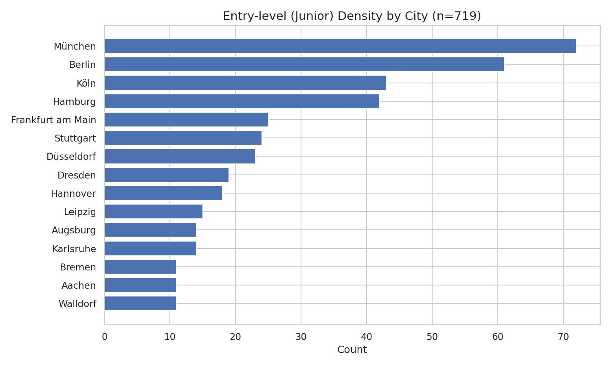
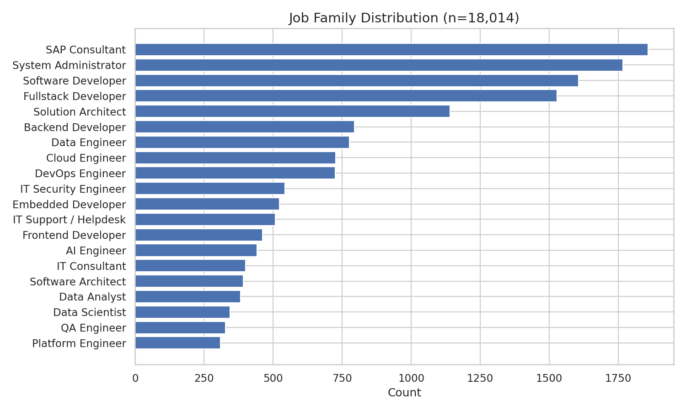
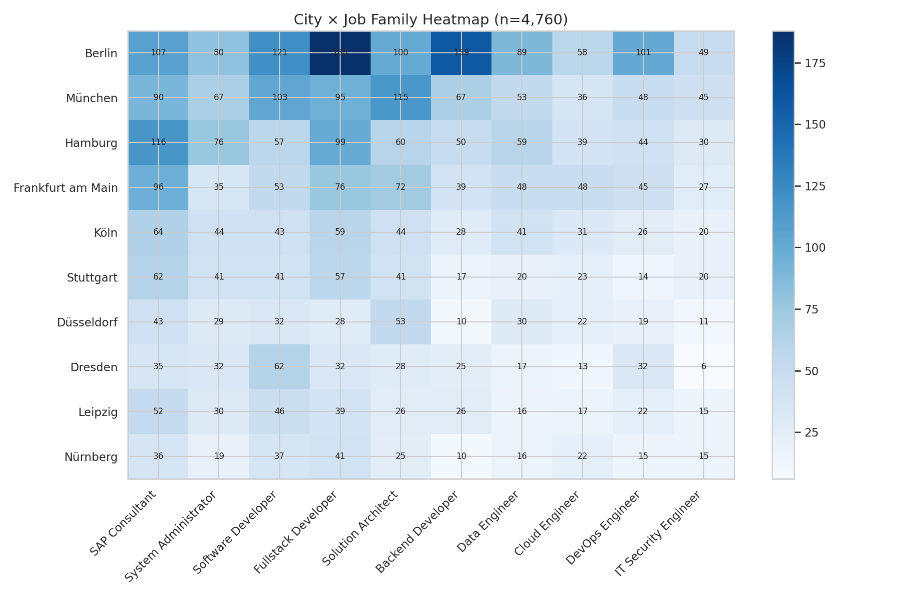
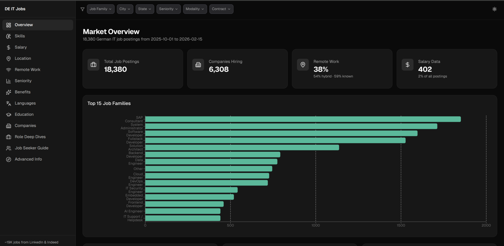

# German IT Job Market Analysis

*This project was carried out as part of the TechLabs "Digital Shaper Program" in Düsseldorf (Winter Term 2025/26).*

---

**Abstract**

If you're a tech professional in Germany or thinking about becoming one you've probably asked yourself: *What skills should I actually learn? Which city fits my seniority, language, and salary expectations? And which roles are the most in-demand and where?*

Career advice is everywhere, but most of it is anecdotal. We wanted answers backed by data.

So we scraped **22,500 job postings** from LinkedIn and Indeed, built a pipeline that enriches each posting with 29 structured fields using a combination of regex extraction and large language model (LLM) inference, and distilled everything into an **interactive web dashboard** anyone can explore.

---

**Overview**

The German IT market is large, fragmented, and constantly shifting but most career guidance relies on gut feeling or outdated reports. We wanted to cut through the noise with data.

This project answers three key questions:

1. **What technical skills are most in-demand** across different IT roles?
2. **Which cities are best for me** given my seniority, language abilities, and salary expectations?
3. **Which roles are most in-demand**, and where should I be looking for each one?

---

**Our Approach**

**1. Evaluate data availability**

We collected **22,526 IT job postings** from Indeed (53%) and LinkedIn (47%). Each listing included title, company, location, description, and posting date. Key challenges: inconsistent schemas across sources, German-specific formatting (gender suffixes like `(m/w/d)`, number formats like `50.000` = 50,000), and heavy cross-platform duplication. After deduplication we retained **18,899 unique postings** from **6,317 companies**.

**2. Exploratory Data Analysis (EDA)**

Initial exploration revealed low salary disclosure (only 2.1%), massive duplication across platforms, uneven field coverage (benefits and education are inconsistently mentioned), and geographic concentration in a handful of cities while still spanning all 16 federal states and 1,100+ city names requiring normalization.

**3. Proof of Concept (PoC)**

We used a **two-tier extraction strategy**: 
- **Regex** for 8 deterministic fields (salary, contract, modality, experience, seniority, languages, education)
- **DeepSeek V3** (LLM) for 7 semantic fields (skills in 3 categories "Technichal, Soft, Nice to have", benefits, tasks, job_family, summary). we used description grouping via MinHash LSH cut API calls by ~20% total LLM cost: **under $10**.

To ensure that the data are correct we had hallucination verifier removes any extracted skill not found in the original text,
cross-field consistency, salary sanity, categorical remapping and unit test.

---

**3.1 What Technical Skills Are Most In-Demand?**

We analyzed 221,459 skill mentions across 18,899 postings.

*Findings:*

- **Python leads** (4,051 mentions), followed by CI/CD, Azure, AWS, Java, Kubernetes, SQL, Docker
- **Skills cluster into stacks:** Python+SQL (data), React+TypeScript (web), Docker+Kubernetes+CI/CD (DevOps); cloud platforms cut across all roles
- **Co-occurrence patterns** reveal implicit employer expectations Docker/Kubernetes nearly always appear together; React/TypeScript are inseparable in frontend postings

*Suggestion:*

Start with **Python + SQL + one cloud platform** (Azure or AWS). Add Docker/Kubernetes for DevOps or React/TypeScript for frontend.

---

**3.2 Which City Is Best for My Seniority, Language, and Salary?**

*Findings:*

- **Berlin leads** (1,919 jobs), München (1,364), Hamburg (1,057). Top 10 cities = 54% of all jobs. Hybrid is the default (52%), remote is strong (40%)
- **For juniors:** Only 4% of postings are entry-level they cluster in **Berlin, München, and Hamburg**
- **For internationals (no German):** 11% of postings are English-only (Data Science, DevOps). These roles skew remote. But B1 German **triples your options**
- **For salary:** Berlin/Munich add €5–10K over the national median (€70K). Data Engineers top at €83K. Only 2.1% of postings disclose salary, so numbers are directional

<table>
  <tr>
    <td></td>
    <td></td>
  </tr>
</table>

*Suggestion:*

Juniors → Berlin/München/Hamburg. Internationals → English-only remote roles, but invest in B1 German. Salary seekers → Berlin or Munich, Data Engineering or Backend, Senior level.

---

**3.3 Which Roles Are Most In-Demand and Where?**

*Findings:*

- **SAP Consultant leads** (1,854), followed by System Administrator (1,761), Software Developer (1,597), Fullstack Developer (1,489) **36% of the market**
- **Cities specialize:** Frankfurt = SAP/finance. Stuttgart = embedded/automotive. Berlin = UI/UX/startups. München = data/cloud
- **Fullstack Developer (1,489)** ranks 4th overall. Backend Developer (769), Data Engineer (753), Frontend Developer (460), and Data Scientist (319) each have distinct skill profiles and city distributions
- **6,317 companies** hiring no single employer dominates

<table>
  <tr>
    <td></td>
    <td></td>
  </tr>
</table>

*Suggestion:*

Don't just search by role **search by role + city**. A Fullstack Developer in Berlin faces a different market than one in Stuttgart. Use the dashboard to find where supply and demand intersect for your profile.

---

**4. Minimum Viable Product (MVP)**

We built a **14-page interactive web dashboard** with filterable analytics (6 filter dimensions), role deep dives for 6 target roles, 4 job seeker personas with tailored recommendations, a salary estimator, skill-based role recommender, and a Germany choropleth map.

Built with React 19, TypeScript, Tailwind CSS, and Recharts. Deployed on Cloudflare Workers with a hybrid data architecture pre-aggregated JSON for instant loads, client-side computation for filtered views.

**Explore it live:** [it-in-de.iebo-testt.workers.dev](https://it-in-de.iebo-testt.workers.dev/)

**GitHub repository:** **[IT in Germany Analysis](https://github.com/AnnieAnh/Techlabs_WS2526_Team1)**

---

**The Team:**

**[Ibrahim Klusmann](https://www.linkedin.com/in/ibrahimklusmann/):** Data Science

**[Gizem Odabas](https://www.linkedin.com/in/sariye-gizem-odabas-405217279):** Data Science

**[Annie Anh Dong](https://www.linkedin.com/in/anh-d-0b9558205):** Data Science

**Mentors** 

**[Moritz Dahm]()**

**[Nopparat Wasikanon]()**

